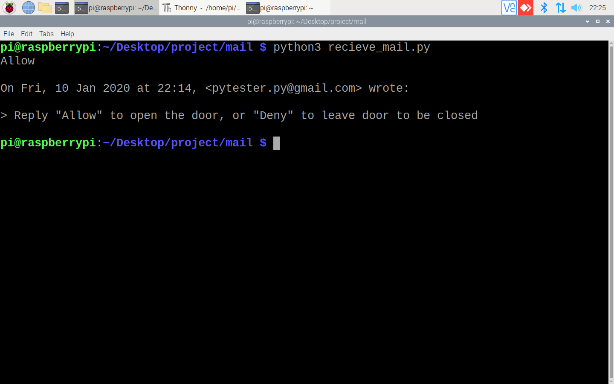

# Smart Door Unocking System using Face Recognition 


[](https://travis-ci.org/joemccann/dillinger)

This proposed system acts as a home security system for both Person detection and provide security for door access control by using facial recognition for the home environment.The human body is identified as an intruder within a home environment achieved by capturing image from web camera and processing will be done on captured images. The web camera captures the series of images as soon as the person come front of the door. The captured image is compared using our face recognition algorithm model. If the person is the authorized one, then the door is unlocked. Conversely, if the person is not the authorized one. The image of the person is sent to the authority, if he recognizes the person and desires to open the door. He can remotely access the door and allow the person in.


#  Features!
        remotely access the door through email
        record video of the intruder in case of any unsual activity


### Tech
* Python
* Opencv
* face_recognition module

### Hardwares
* RASPBERRY PI 
* LOGITECH C310 WEBCAM HD
*  ELECTRONIC DOOR STRIKE

The hardware setup images are given in images folder.

### Installation
Install the dependencies .

```sh
$ pip3 install opencv-python
$ pip3 install face-recognition
```


### Development


#### Building for source
 Installing the dependencies in raspberry pi follow this
 
1 . First run the detection.py which capture a series of images of authority.
This is the initial step as this images are used for training the face recognition module.


2 .Recognition.py contains the code for recognizing the face

3.The output of this file is either "known" or "unknown".In case of known the lock.py file is executed and door will open

4.Else send_mail.py file will be executed which request an access for opeing door to the authority through email.



5.The receive_mail.py  wait for reply from the authority.Upon receiving the mail if input is "allow" the door opens.


6.Even after the denying the access to door the video_cap.py is executed which captures a video of the intruder's activity and send the mail to the authority through e-mail.

### Executing Code 
Inorder to tun python file in raspberry pi use the following cmd 
```sh
$LD_PRELOAD=/usr/lib/arm-linux-gnueabihf/libatomic.so.1.2.0 python3 "PYTHON FILE".py
```
link to sample working video:<a>https://www.youtube.com/watch?v=kzpoJactA7Q</a>


License
----

MIT


**Free Software, Hell Yeah!**

[//]: # (These are reference links used in the body of this note and get stripped out when the markdown processor does its job. There is no need to format nicely because it shouldn't be seen. Thanks SO - http://stackoverflow.com/questions/4823468/store-comments-in-markdown-syntax)


   [dill]: <https://github.com/joemccann/dillinger>
   [git-repo-url]: <https://github.com/joemccann/dillinger.git>
   [john gruber]: <http://daringfireball.net>
   [df1]: <http://daringfireball.net/projects/markdown/>
   [markdown-it]: <https://github.com/markdown-it/markdown-it>
   [Ace Editor]: <http://ace.ajax.org>
   [node.js]: <http://nodejs.org>
   [Twitter Bootstrap]: <http://twitter.github.com/bootstrap/>
   [jQuery]: <http://jquery.com>
   [@tjholowaychuk]: <http://twitter.com/tjholowaychuk>
   [express]: <http://expressjs.com>
   [AngularJS]: <http://angularjs.org>
   [Gulp]: <http://gulpjs.com>

   [PlDb]: <https://github.com/joemccann/dillinger/tree/master/plugins/dropbox/README.md>
   [PlGh]: <https://github.com/joemccann/dillinger/tree/master/plugins/github/README.md>
   [PlGd]: <https://github.com/joemccann/dillinger/tree/master/plugins/googledrive/README.md>
   [PlOd]: <https://github.com/joemccann/dillinger/tree/master/plugins/onedrive/README.md>
   [PlMe]: <https://github.com/joemccann/dillinger/tree/master/plugins/medium/README.md>
   [PlGa]: <https://github.com/RahulHP/dillinger/blob/master/plugins/googleanalytics/README.md>
